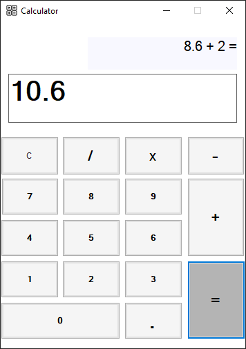

# Calculator- VisualBasic

This assignment was project was a personal project that was made in the third year of my bachelor's program at Hashemite University.

In which, I decided to make a simple calculator in visual basic.net, in which it calculates the following main four opperations:
 - Addition
 - Subtraction
 - multiplication
 - division

Also, it will contain the following features:
 - operations history
 - clear all input to the calculator with a button (C)
 - calculate opperations on decimal numbers too

 Attached you will find the final project form:
 
 
